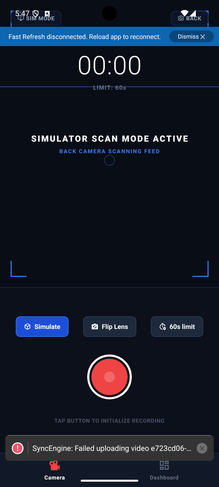
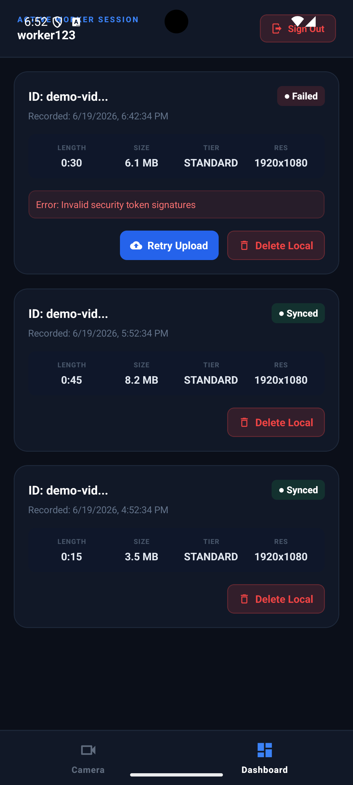

# Locara Labs: Egocentric Video Capture System

A production-grade, secure, and offline-resilient Egocentric Video Capture System. This workspace includes a React Native mobile client, a robust FastAPI backend service, and modular AWS Terraform configurations.

---

## 📂 Repository Directory Layout

*   **[`/frontend`](file:///Users/aryanbarnwal/Projects/Assignment/frontend)**: React Native mobile application supporting timer-based first-person recording, a local offline-first SQLite database, a background upload queue with exponential backoff, and a keyset-paginated video dashboard.
*   **[`/backend`](file:///Users/aryanbarnwal/Projects/Assignment/backend)**: Python FastAPI backend providing authenticated session handshakes, scoped S3 presigned PUT URL generation with worker-level path isolation, and database update webhook integrations.
*   **[`/infra/terraform`](file:///Users/aryanbarnwal/Projects/Assignment/infra/terraform)**: Modular, production-grade infrastructure configurations for AWS provisioning, including IAM permissions, S3 lifecycle policies (Glacier tiering), and Lambda events.
*   **[`SYSTEM_DESIGN.md`](file:///Users/aryanbarnwal/Projects/Assignment/SYSTEM_DESIGN.md)**: Detailed technical document covering architecture diagrams, database schema optimization (index justifications, SQLite WAL concurrency, keyset cursor pagination), AWS cost optimization metrics, and 10K user scaling plans.

---

## 📱 Application UI Showcase

| Camera Capture Interface | Video Management Dashboard |
| :---: | :---: |
|  |  |

---

## 🛠️ Step-by-Step Setup & Running Guide

### 1. Python FastAPI Backend Service

#### Prerequisites
*   Python 3.11+

#### Setup Instructions
1.  Navigate to the backend folder:
    ```bash
    cd backend
    ```
2.  Create and activate a Python virtual environment:
    ```bash
    python3 -m venv .venv
    source .venv/bin/activate
    ```
3.  Install dependencies:
    ```bash
    pip install -r requirements.txt
    ```
4.  Copy environment configurations:
    ```bash
    cp .env.example .env
    ```
5.  Start the FastAPI development server:
    ```bash
    uvicorn app.main:app --host 0.0.0.0 --port 4000 --reload
    ```
    The Swagger interactive documentation will be available at `http://localhost:4000/docs`.

---

### 2. React Native Client Application

#### Prerequisites
*   Node.js (v18+)
*   Android SDK & Android 10+ Emulator/Device (or Xcode for iOS development)

#### Setup Instructions
1.  Navigate to the frontend folder:
    ```bash
    cd frontend
    ```
2.  Install packages:
    ```bash
    npm install
    ```
3.  *(Optional iOS setup)* Install CocoaPods:
    ```bash
    cd ios
    bundle install
    bundle exec pod install
    cd ..
    ```
4.  Start the Metro bundler server:
    ```bash
    npm start
    ```
5.  In a separate terminal, launch the application:
    *   **Android (default)**:
        ```bash
        npm run android
        ```
    *   **iOS**:
        ```bash
        npm run ios
        ```

---

### 3. AWS Infrastructure Provisioning (Terraform)

#### Prerequisites
*   Terraform CLI (>= 1.5.0)

#### Setup Instructions
1.  Navigate to the Terraform folder:
    ```bash
    cd infra/terraform
    ```
2.  Review and customize settings in [terraform.tfvars](file:///Users/aryanbarnwal/Projects/Assignment/infra/terraform/terraform.tfvars) (e.g. bucket naming, backend webhook URLs).
3.  Initialize the workspace:
    ```bash
    terraform init
    ```
4.  Preview resources:
    ```bash
    terraform plan
    ```
5.  Deploy configuration:
    ```bash
    terraform apply
    ```

---

## 📈 System Design, Database Optimization & AWS Cost Analysis

Please refer to the root [**`SYSTEM_DESIGN.md`**](file:///Users/aryanbarnwal/Projects/Assignment/SYSTEM_DESIGN.md) for full evaluations regarding:
*   **Decoupled S3 presigned URL uploads** directly from the client.
*   **SQLite schema details** (`attempt_count`, `last_error`, JSON metadata column) and SQLite WAL performance concurrency settings.
*   **Database Query Optimization** using keyset-based cursor pagination (`idx_videos_worker_history` index).
*   **AWS Least-Privilege IAM Policies** and worker isolation schemas.
*   **Storage cost projections** ($9,060 stabilized monthly run-rate for 900TB storage using Glacier lifecycle rules).
*   **Reliability systems** including S3 bucket notifications triggering Lambda-based webhook updates.
*   **Scalability plans** detailing how RDS Proxy, Amazon SQS buffers, and celery workers resolve bottleneck challenges at 10K concurrent users.

---

## 💾 Local Database Strategy (Rubric Requirements)

### 1. Production SQLite Schema Migration Strategy
*Scenario: Adding a `gps_accuracy` (REAL) column to 50K existing rows on an app update.*

Since mobile SQLite does not support standard online columns insertions with nested integrity in legacy OS setups, we use a transaction-safe table migration pattern:
1.  **ACID Transaction Lock**: Open a transaction (`BEGIN TRANSACTION;`) to ensure the update either succeeds completely or rolls back on failure, avoiding database corruption.
2.  **Create Temp Table**: Create a temporary table `videos_temp` matching the desired schema, appending the new `gps_accuracy REAL` column.
3.  **Data Copy**: Copy the 50K existing records from `videos` to `videos_temp`, mapping `NULL` for the new `gps_accuracy` column.
4.  **Swap Tables**: Drop the old `videos` table and rename `videos_temp` to `videos` (`ALTER TABLE videos_temp RENAME TO videos;`).
5.  **Re-create Indexes**: Re-apply optimal performance indexes (`idx_videos_upload_queue`, `idx_videos_worker_history`).
6.  **Commit**: Commit the transaction (`COMMIT;`).

*Full SQL script for this migration plan is documented in [**`SYSTEM_DESIGN.md` (Section 2 - Migration Strategy)**](file:///Users/aryanbarnwal/Projects/Assignment/SYSTEM_DESIGN.md#L106-L166).*

### 2. Query Efficiency & Keyset Pagination
*Scenario: Optimizing listings and filters for active worker records.*

*   **Anti-Pattern (Offset Pagination)**: Queries using `LIMIT 20 OFFSET 10000` exhibit $O(N)$ linear complexity, forcing SQLite to scan and discard 10,000 records before returning the next 20.
*   **Optimized Solution (Keyset Cursor-based Pagination)**: The dashboard queries records relative to the last item loaded (`started_at` timestamp and tie-breaker `video_id` cursor):
    ```sql
    SELECT * FROM videos
    WHERE worker_id = :worker_id
      AND (started_at < :cursor_timestamp OR (started_at = :cursor_timestamp AND video_id < :cursor_id))
    ORDER BY started_at DESC, video_id DESC
    LIMIT 20;
    ```
    This translates to a binary search lookup ($O(\log N)$) using the composite index `idx_videos_worker_history ON videos(worker_id, started_at DESC, video_id DESC)`.
*   **Filtered Indexing**: Background upload queues scan only unsynced videos using a conditional index:
    ```sql
    CREATE INDEX idx_videos_upload_queue ON videos(upload_state) WHERE upload_state IN ('pending', 'failed');
    ```
    This skips scanning the millions of successfully `uploaded` entries.
